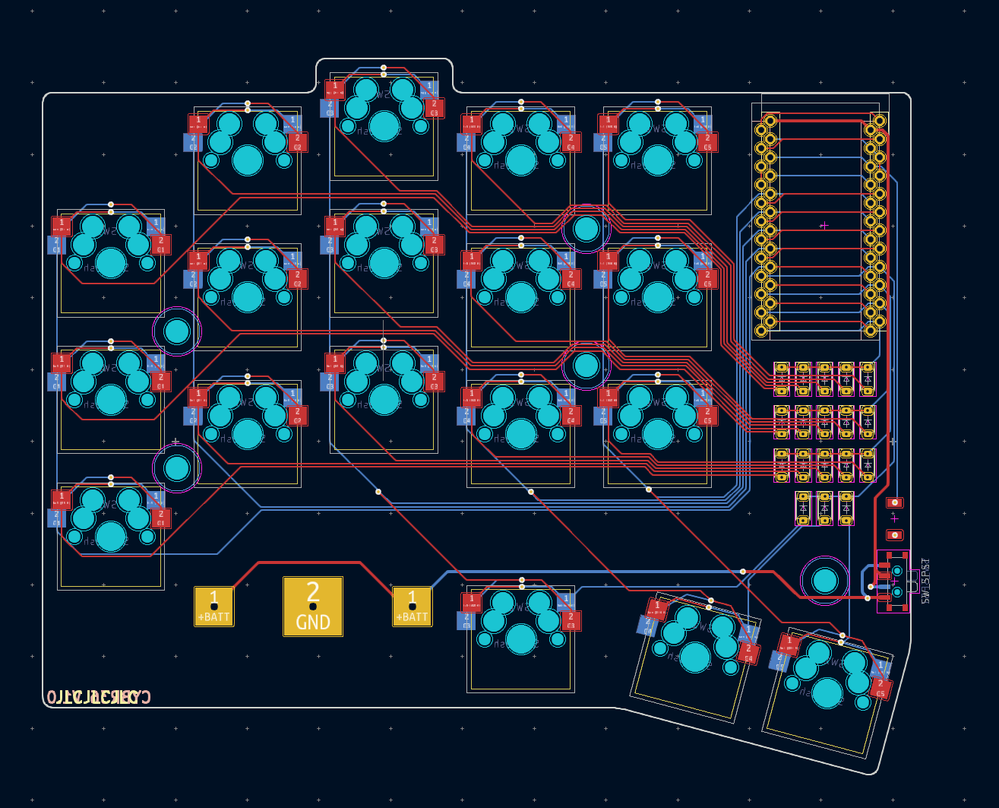

# cybr36
 The cybr36 is a no frills, wireless, 36 key, column-staggered keyboard sporting button cell batteries and nice!nano controllers.

 

 

 

 

 

 

## Firmware
The cybr36 runs ZMK firmware which can be found on my profile [here](https://github.com/Sleepyboi7973/zmk-config-cybr36).

## Case Printing Tips
Print the plate at 100% size and the case at 101.5% size to ensure that the pcb and plate fit inside without issue. I printed my case with no top or bottom layers, no supports, and triangular infill at 30%

## Build Guide

### Bill of Materials:
| BOM                          |    |
|------------------------------|----|
| PCB                          | 2  |
| Plate                        | 2  |
| Case                         | 2  |
| Rubber Feet                  | 10 |
| 10mm M2 Screw                | 8  |
| nice!nano V2                 | 2  |
| 1x12 Pin Header              | 4  |
| MX Switches                  | 36 |
| MX 1u Keycaps                | 36 |
| MX Hotswap Sockets           | 36 |
| SOD-123 1N4148 Diodes        | 36 |
| PCM12/MSK12 SMD Slide Switch | 2  |
| 3x4x2mm 2 Pin SMD Button     | 2  |
| 2430 Battery Holder          | 2  |
| 2430 Battery                 | 2  |
